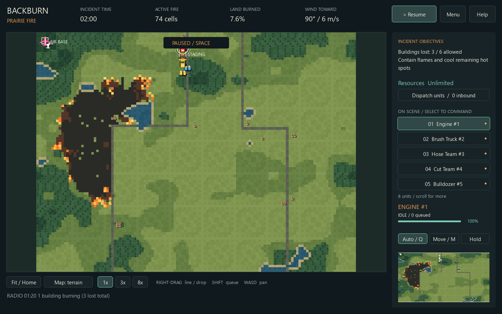

# Backburn

An original top-down wildfire tactics game for Windows. Read the wind, send crews to
cut firebreaks, coordinate air drops, and bring stranded hikers home.



## Download and play

Download **[Backburn-Setup.exe](https://github.com/Smithey-Lab/backburn/releases/latest/download/Backburn-Setup.exe)**,
open it, and click **Install Backburn**. No Python, Git, or administrator account is needed.
The Desktop shortcut opens a launcher with **Play** and **Install update** buttons.
Saves and scores survive updates. Offline play is supported after installation.

Prefer portable? Extract the [Windows zip](https://github.com/Smithey-Lab/backburn/releases/latest/download/Backburn-Windows-x64.zip)
and run Backburn.exe. Windows binaries are currently unsigned.
See [installation details](docs/INSTALLING.md) and [release notes](docs/RELEASE_NOTES.md).

## The demo

- Eleven incidents on large generated maps: Prairie Fire, Stranded Hikers, Refinery Row,
  Wall of Fire, Canyon Run, Lakeshore Cabins, Highway 9, Timber Ridge, Ember Storm,
  Fire Complex and The Long Watch, plus a Random Incident mode with a reroll button.
- Wind, slope, fuel, moisture, water, retardant, smoldering and airborne embers.
- Engines, brush trucks, hose teams, cut teams, dozers, hotshots, helicopters and bombers.
- Helicopter rescues, resource dispatch, weather events, objectives and scores.
- Mission briefings, field guide, unit roster, minimap, tactical overlays and sandbox tools.
- Original procedural sprites, animated fire and synthesized interface sounds.
- Quicksaves, autosaves, replay export, personal bests and GitHub updates.

Single player. Multiplayer, voice and a full scenario authoring interface are future work.
This is a game, not an operational wildfire model. Balance is experimental.

## Controls

| Action | Control |
|---|---|
| Select unit | Left-click map or roster |
| Context order | Right-click |
| Cut line / aircraft drop | Right-drag from start to end |
| Queue orders | Hold Shift |
| Rescue | Select helicopter, click hiker; right-click safe zone to unload |
| Force move / restore context orders | M / Q |
| Pause and plan | Space |
| Speed | 1 / 2 / 3 / 4 (1×, 3×, 8×, 16×) |
| Pan / zoom / fit | WASD (hold Shift for fast) or middle-drag / wheel / Home / click the minimap |
| Dispatch / help / overlay | B / H / O |
| Save / load / export replay | F6 / F7 / F5 |

Incidents open paused for planning. Normal speed is one simulation second per real second.
Maps are about 3.5 km across (up to 1440×990 cells, roughly 3 m per cell) and extend far
beyond the initial camera view; use WASD (Shift to hurry), the wheel or the minimap to
explore, and Home for an overview. Long missions play well at 8× and 16×.

Every new mission starts with **no response units**. Press **B** to buy your fleet.
Ground-unit purchases made before the incident clock starts cost budget but are ready immediately;
later reinforcements use the displayed arrival countdown. Civilians remain on the map.

Select the **Aircraft** roster tab to command planes even while they are off-map.
Right-drag a curved route: coverage circles show exactly the planned swath, and the route
stops at the available payload limit. Release to confirm, hold Shift to queue, or press Esc
to cancel. Short drops consume only the payload used. Planes start empty and load off-map after you
resume; you can queue their first drop while loading. Planes exit through the nearest map
edge and reload outside it. Watch **READY 100%** and the reload countdown. Helicopters retain
hovering and rescues. Select a card and use **Locate** to center on any unit.

Circle previews are spaced apart for clarity. Dozers and cut crews also preview curved,
continuous firebreaks, and suppression units show their target radius. Bulldozers travel at
road speed on highways and gravel when they are not cutting, and long orders are routed
along roads, so a dozer can get ahead of the fire; off the road it walks, and it cuts at
its usual pace. Cleared firebreaks
have no fuel and block direct spread, including diagonal gaps between touching cleared
cells. Strong winds can carry embers over them.

The map wind indicator points **toward** the direction the wind carries fire, and shows
speed and ember risk. Wind gradually gusts and shifts in new missions. Strong-wind ember
trails show where spotting can cross your lines. There is no on-map air-base marker.

WASD works at overview zoom too. The camera can travel into a bounded margin beyond the
map; Home recenters the overview. Existing saves keep their original units and layout.

Try Stranded Hikers: buy a helicopter before resuming, queue pickups and return to the
safe zone. Several incidents are also won by holding the line until the clock runs out;
the objectives panel says so. Random Incident rolls a new map and briefing from a seed.

## Development

Python 3.14 is used for CI and Windows builds; the source requires Python 3.12 or newer.

```sh
python -m venv .venv
# Activate the virtual environment for your shell, then:
pip install -r requirements-dev.txt
python -m backburn.game
python -m pytest
ruff check .
ruff format --check .
python tools/gen_tables.py --check
python tools/build_release.py  # Windows
```

The original tuning harness remains available as `python -m backburn view` and the
headless tools as `python -m backburn --help`. `python tools/author_missions.py` rebuilds
the shipped missions from their placement rules. `godot/` is an archived port experiment;
the shipping desktop game uses pygame-ce and the existing NumPy simulation.

`main` is the release branch, `develop` the integration branch, and `feature/*` / `fix/*`
branches carry changes through pull requests. See [repository workflow](docs/REPOSITORY.md),
[architecture decisions](DECISIONS.md), [simulation docs](docs/ARCHITECTURE.md), and
[security policy](SECURITY.md).

## Project origins

Built from the user-supplied Backburn v0.2.0 prototype and research brief, inspired by
classic FireJumpers gameplay. Code and visuals are original; no extracted game assets
or original-game code are distributed. Not affiliated with the original developer.
The repository is public for development and distribution. No open-source license is
currently granted; the prototype's all-rights-reserved status is retained.
